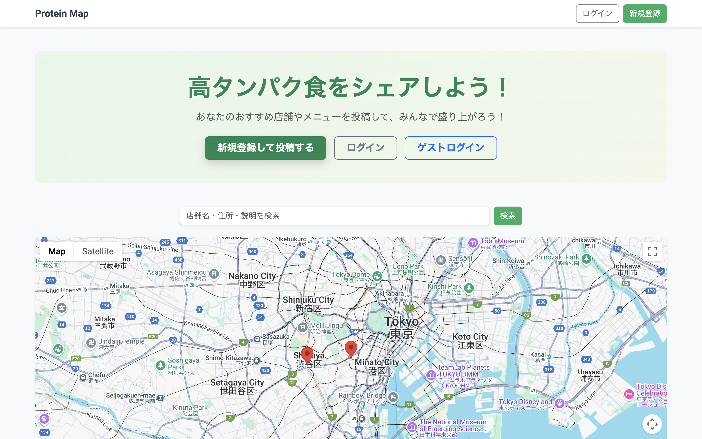

# Protein Map - 高タンパク食をシェアするアプリ

## 1. サービス概要
「高タンパクな食事」を投稿・共有し、みんなで健康的な食生活を盛り上げるWebアプリです。

## 2. サービス画像
### トップページ

## 3. サービスURL
https://protein-map-app.herokuapp.com/

## 4. サービスの概要
「Protein Map」は、おすすめの高タンパク食メニューや店舗を地図上で簡単に共有・検索できるアプリです。
ユーザーは店舗やメニューを投稿したり、お気に入り登録をして管理できます。

## 5. 開発背景
ジム通いやボディメイクに励む人が増える中で、「高タンパク食の外食先がわからない」という悩みを解決するために開発しました。
GoogleマップAPIを活用し、位置情報ベースで店舗やメニューを探しやすくしています。

## 6. 主な機能
- ユーザー登録/ログイン/ゲストログイン
- 店舗の登録・編集・削除
- メニューの登録・編集・削除
- 店舗・メニューの検索（あいまい検索対応）
- お気に入り機能
- Googleマップ上に店舗の位置を表示

## 7. 使用技術
- **フロントエンド**: HTML / CSS / JavaScript / Bootstrap
- **バックエンド**: Ruby 3.3.3 / Ruby on Rails 8.0.2
- **データベース**: PostgreSQL
- **インフラ**: Heroku
- **バージョン管理**: Git / GitHub

## 8. ER図
以下のER図のように4つのテーブルで構成されています。

---

## 9. 今後の展望
- 店舗やメニューのレビュー機能追加
- 投稿画像のアップロード機能
- 統計機能（ユーザー別の投稿数やお気に入りランキングなど）
